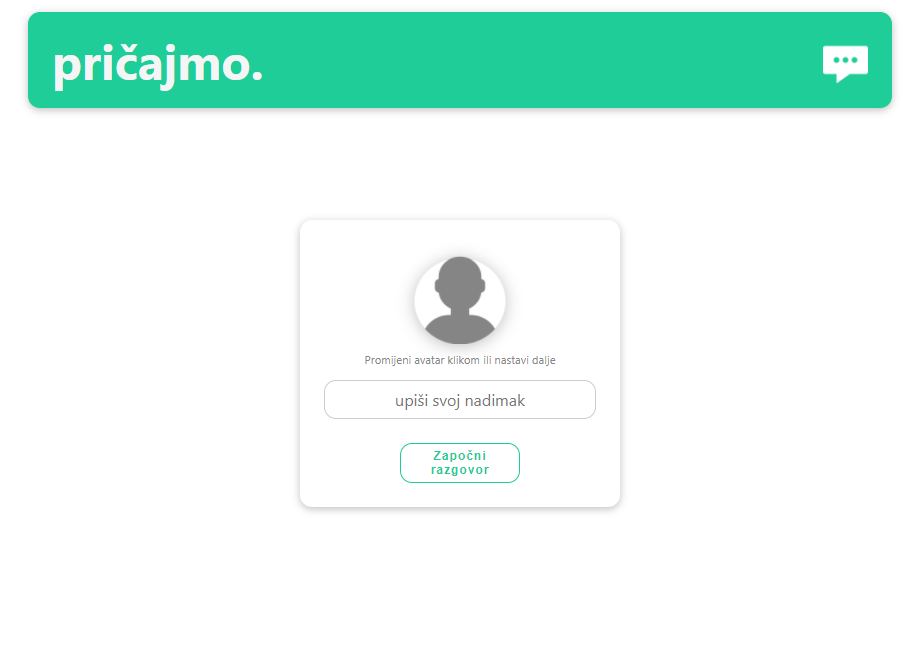
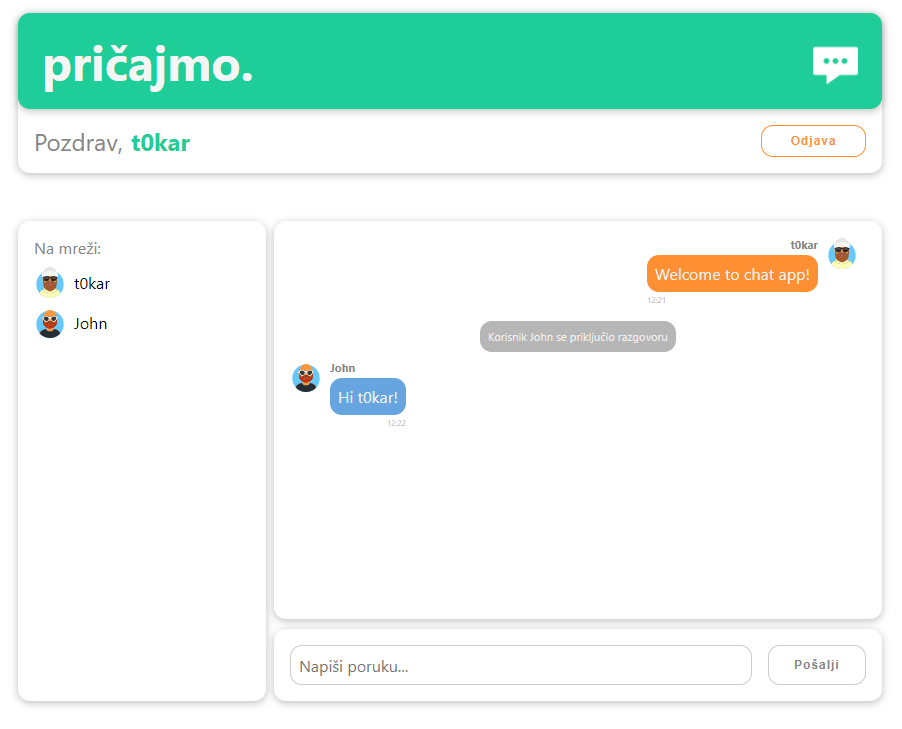

# Chat application

This chat application is final project for front-end developer course.

## Project Status

[](https://app.netlify.com/sites/chat-app-tokar/deploys)

[https://chat.tokar.com.hr/](https://chat-app-tokar.netlify.app/)

## Technologies Used

- ReactJS - version 17.0.2
- Scaledrone

## Setup

To install all required dependencies run

```
$ nmp install
```

and start application with

```
$ npm start
```

### Scaledrone

You can connect to your own channel using a [_Scaladrone_](https://www.scaledrone.com/) service.

Replace `{YOUR_CHANNEL_ID}` with your channel ID from the Scaledrone's dashboard.

```javascript
const myChannelID = '{YOUR_CHANNEL_ID}';
```

## Features

- choose avatar
- enter your nickname
- send and receive messages in real time
- preview online users
- message when user join / leaves the room
- logout

## Screenshots




## Room for Improvement

To do:

- add emoji picker
- use Context
- use local module for avatars

## Contact

Created by [@t0kar](https://github.com/t0kar)
